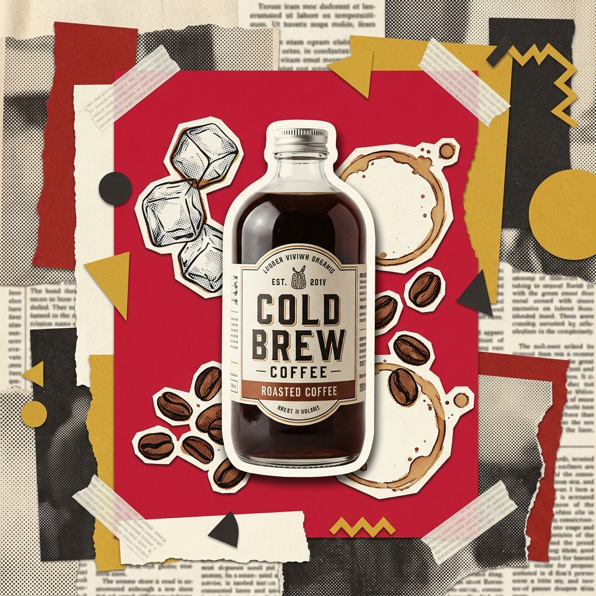

<p align="right"><b>English</b> · <a href="README.zh.md">简体中文</a></p>

# 🎬 Vox Director & Veo 3.1 ComfyUI Nodes

**Turn one topic, talking-head video, or photo into a finished Vox-style paper-collage explainer / ad video — script, collage keyframes, motion, voice-over, music and captions, all automated.**

An **agent skill** and **ComfyUI node suite** running end to end on the [MuAPI](https://muapi.ai) platform + local `ffmpeg`, usable by any coding agent (Claude Code, Codex, Antigravity, etc.) or within ComfyUI. Give it a one-line topic, presenter video, or product photo; it gives you an `mp4`.

   

<div align="center">

`out/demo/final.mp4`

<b>▶ "History of Coffee (Ethiopia 850 AD)" · 5s (B-roll)</b>

</div>

<table>
  <tr>
    <td width="50%"><a href="out/demo/final.mp4"></a></td>
    <td width="50%"><a href="out/demo-croll/final.mp4"></a></td>
  </tr>
  <tr>
    <td align="center"><sub>History of Coffee · 5s (B-roll)</sub></td>
    <td align="center"><sub>Cold Brew Product Ad · 5s (C-roll)</sub></td>
  </tr>
</table>

<p align="center"><sub><em>▶ Click any thumbnail/path to play generated video</em></sub></p>

---

## 📽️ Generated Showcase Videos (Generated with MuAPI)

Below are end-to-end videos generated using the **MuAPI Director** pipeline:

| Mode | Film Title | Topic / Subject | Generated Video Output | Keyframe Poster | Motion Model | Narration Voice |
|---|---|---|---|---|---|---|
| **B-roll** | **☕ History of Coffee** | *Ethiopia 850 AD* | `out/demo/final.mp4` | `out/demo/keyframes/kf_1a.jpg` | `veo3.1-image-to-video` | MiniMax TTS (`Q19bea09caa6IRAeW7`) |
| **C-roll** | **🍾 Cold Brew Product Ad** | *Artisanal Cold Brew Bottle* | `out/demo-croll/final.mp4` | `out/demo-croll/keyframes/kf_1.jpg` | `veo3.1-image-to-video` | MiniMax TTS (`Q19bea09caa6IRAeW7`) |

> 🎬 **Generated Assets Summary:**
> - ☕ **B-roll (History of Coffee):**
>   - 🖼️ **Poster:** `out/demo/keyframes/kf_1a.jpg` \| 📹 **Clip:** `out/demo/clips/clip_1a.mp4` \| 🎙️ **Voice:** `out/demo/audio/narr_1.mp3` \| 🎵 **BGM:** `out/demo/audio/bgm.mp3`
> - 🍾 **C-roll (Cold Brew Product Anchor):**
>   - 📸 **Anchor Photo:** `out/demo-croll/anchor_photo.jpg` \| 🖼️ **Poster:** `out/demo-croll/keyframes/kf_1.jpg` \| 📹 **Clip:** `out/demo-croll/clips/clip_1.mp4` \| 🎙️ **Voice:** `out/demo-croll/audio/narr_1.mp3` \| 🎵 **BGM:** `out/demo-croll/audio/bgm.mp3`

---

## What it is

The look is the modern editorial **paper-collage** popularized by Vox explainers: hand-cut paper cut-outs, torn edges, tape, halftone dots, newspaper clippings, bold flat color per beat, big cut-out headlines — brought to life with motion, a narrator, music and captions.

## How it works

One project flows through specific pipeline scripts, all driven by a single `beats.json` per project under `out/<project>/`:

```
topic / video / photo
  │
  ├─ 1. beat map        pick a narrative arc → write beats.json      ◀── GATE 1: you approve the beat map
  ├─ 2. style bake-off  render the same beat in 3–4 themes           ◀── GATE 2: you pick the look by eye
  ├─ 3. keyframes       one collage poster per beat  (nano-banana-2 / flux-dev)
  ├─ 4. motion          animate each poster          (veo3.1-image-to-video)
  ├─ 5. voice + music   narration (minimax-speech-2.6) + BGM (suno-create-music)
  ├─ 6. assemble        ffmpeg: concat, duck music under VO, burn captions + watermark
  └─ final.mp4
```

Three input modalities share this engine:

- **B-roll — give it a topic and walk away.** It writes the script, generates every collage keyframe, animates with Veo 3.1, adds voice-over + music, and assembles the video.
- **A-roll — you already have a talking-head video.** It is ASR-segmented into beats (`openai-whisper`) and re-styled into the collage look, keeping the real face, lip-sync and gestures frame-for-frame (`gemini-omni-video-edit` / `veo3.1`).
- **C-roll — you have one still photo** (a selfie or product shot). The subject is cut out as a photographic sticker — never redrawn — and each beat's poster is generated around it (`nano-banana-2` / `flux-dev`). Narration can use voice cloning (`minimax-voice-clone`).

Two core principles make the result:

1. **The look is born in the image step.** Each beat is a finished collage *poster*. All the collage DNA (torn paper, cut-outs, halftone, headline text) lives in that image.
2. **The motion is added after.** An AI video model (Google Veo 3.1) animates the poster into a living motion graphic.

Two human decision gates keep you in control (approve the beat map; pick the style); everything else is automated.

## Models (verified on MuAPI)

| Job | Model |
|---|---|
| Keyframe / collage poster | `nano-banana-2` / `flux-dev` |
| Animate / Motion | `veo3.1-image-to-video` / `veo3.1-fast-image-to-video` |
| Re-style a talking-head (A-roll) | `gemini-omni-video-edit` / `veo3.1-image-to-video` |
| Anchor a photo in the collage (C-roll) | `nano-banana-2` / `flux-dev` |
| Narration TTS | `minimax-speech-2.6-turbo` |
| Narration Voice Cloning | `minimax-voice-clone` |
| Background Music | `suno-create-music` |
| Audio Transcription (A-roll ASR) | `openai-whisper` |
| Background Removal | `remove-background` |

## Vox Director Quick Start (Agent Skill)

Set your **MuAPI** API key (get one at [muapi.ai](https://muapi.ai)):
```bash
export MUAPI_API_KEY="sk-..."
```

### 1. B-roll (Topic → Film)
Ask your coding agent:
> *"Make me a Vox-style collage video about the History of Coffee — English, 16:9, 15 seconds."*

Or run manually:
```bash
python scripts/style_bakeoff.py out/my-topic american-retro,swiss-modern,punk-zine
python scripts/keyframes.py out/my-topic
python scripts/clips.py out/my-topic
python scripts/audio.py out/my-topic
python scripts/assemble.py out/my-topic
```

### 2. A-roll (Talking-Head Video → Collage)
```bash
python scripts/asr_beats.py out/my-aroll source_presentation.mp4
python scripts/aroll_clips.py out/my-aroll
python scripts/aroll_assemble.py out/my-aroll
```

### 3. C-roll (Single Photo / Product → Anchored Collage)
```bash
python scripts/croll_keyframes.py out/my-croll
python scripts/clips.py out/my-croll
python scripts/audio.py out/my-croll
python scripts/assemble.py out/my-croll
```

---

# Veo 3.1 ComfyUI Nodes

ComfyUI custom nodes for generating videos with Google's **Veo 3.1** model via the [MuAPI](https://muapi.ai) platform.

## Related Projects

- [Veo 3 on MuAPI](https://muapi.ai/veo3) — Model landing page for Veo generation.
- [Veo 3 text-to-video playground](https://muapi.ai/playground/veo3-text-to-video) — Try the model directly in the browser.
- [veo4-video-generator](https://github.com/SamurAIGPT/veo4-video-generator) — Ready-made Next.js SaaS for Veo — no ComfyUI needed
- [Veo-4-API](https://github.com/Anil-matcha/Veo-4-API) — Python wrapper for Veo 4 API — use the latest Veo model in scripts
- [muapi-comfyui](https://github.com/SamurAIGPT/muapi-comfyui) — ComfyUI nodes for 100+ MuAPI models including Veo
- [awesome-ai-video-models](https://github.com/Anil-matcha/awesome-ai-video-models) — compare AI video models by API, price & speed

## Nodes

| Node | Description |
|------|-------------|
| 🎬 Veo 3.1 Text to Video | Generate 8-second video from a text prompt |
| 🎬 Veo 3.1 Image to Video | Animate a static image; optionally anchor the last frame |
| 🎬 Veo 3.1 Reference to Video | Generate video guided by up to 4 reference images |
| 🎬 Veo 3.1 Extend Video | Continue a previous generation with a new prompt |
| 🎬 Veo 3.1 4K Upscale | Upscale any previous Veo 3.1 generation to 4K |
| 🎬 Veo 3.1 Save Video | Download & save generated video; returns frames tensor |

All nodes live in the **🎬 Veo 3.1** category in the ComfyUI node menu.

## Available Models

### Text to Video
| Model | Speed | Quality |
|-------|-------|---------|
| `veo3.1-text-to-video` | Standard | Highest, with audio |
| `veo3.1-fast-text-to-video` | Fast | Good |
| `veo3.1-lite-text-to-video` | Fast | Lightweight |

### Image to Video
| Model | Speed | Quality |
|-------|-------|---------|
| `veo3.1-image-to-video` | Standard | Highest, with audio |
| `veo3.1-fast-image-to-video` | Fast | Good |
| `veo3.1-lite-image-to-video` | Fast | Lightweight |

### Other Variants
- `veo3.1-reference-to-video` — multi-image reference generation
- `veo3.1-extend-video` — extend a previous generation
- `veo3.1-4k-video` — upscale a previous generation to 4K

All models output **8-second** videos (Veo 3.1 fixed duration).

## Installation

```bash
cd ComfyUI/custom_nodes
git clone https://github.com/YOUR_USERNAME/muapi-veo31-comfyui
pip install -r muapi-veo31-comfyui/requirements.txt
```

Restart ComfyUI.

## Setup

1. Get an API key from [MuAPI](https://muapi.ai)
2. Paste it into the `api_key` field of any Veo 3.1 node

## Parameters

### Common
| Parameter | Description |
|-----------|-------------|
| `api_key` | Your MuAPI API key |
| `prompt` | Text description of the video |
| `aspect_ratio` | `16:9` or `9:16` |
| `resolution` | `720p`, `1080p`, or `4k` |
| `extra_params_json` | Any additional model parameters as JSON |

### Image to Video extras
| Parameter | Description |
|-----------|-------------|
| `image` | Start frame (IMAGE tensor) |
| `last_image` | Optional end frame for first–last mode |

### Reference to Video extras
| Parameter | Description |
|-----------|-------------|
| `image_1` … `image_4` | Reference images (up to 4) |
| `generate_audio` | Whether to generate audio (default: true) |

### Extend / 4K Upscale
| Parameter | Description |
|-----------|-------------|
| `request_id` | `request_id` output from a previous generation node |

## Example Workflows

| File | Description |
|------|-------------|
| `MuAPI_Veo31_T2V_Example.json` | Text → Video → Save |
| `MuAPI_Veo31_I2V_Example.json` | Image → Video → Save |
| `MuAPI_Veo31_Reference_Example.json` | 2 reference images → Video → Save |

Load any workflow via **ComfyUI → Load** (drag & drop the JSON).

## Chaining nodes

```
Veo31TextToVideo
  └─ video_url  ──► Veo31VideoSaver ──► frames ──► PreviewImage
  └─ first_frame──► PreviewImage
  └─ request_id ──► Veo31ExtendVideo
                       └─ request_id ──► Veo314KUpscale
```

## Requirements

- Python 3.8+
- ComfyUI (any recent version)
- `requests`, `Pillow`, `numpy`, `torch`, `opencv-python`

## License

MIT
